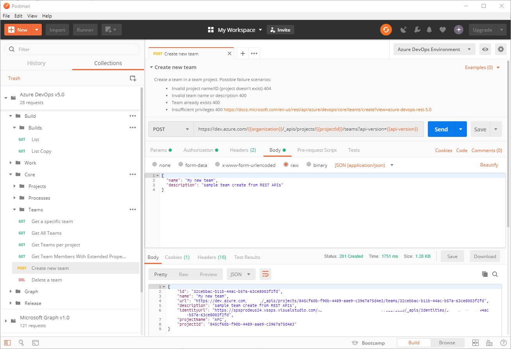

# Azure DevOps Postman Collections

> Inspired by [@Jeremy Thake](https://github.com/jthake-msft)'s [Microsoft Graph Collection](https://github.com/microsoftgraph/microsoftgraph-postman-collections/blob/master/README.md)

The collections allows you to test common Azure DevOps Rest APIs from within Postman.

## Setup

To setup the Postman collections follow these steps:

1. Download and register for Postman from their [website](https://www.getpostman.com/) or from [chocolatey.org](https://chocolatey.org/packages/postman).

1. Click **File | Import ...**.

1. Select **Import From Link**.

1. Paste the following two URLs and click Import after each.

   > [https://raw.githubusercontent.com/hkamel/azuredevops-postman-collections/master/Azure%20DevOps%20v5.0.postman_collection.json](https://raw.githubusercontent.com/hkamel/azuredevops-postman-collections/master/Azure%20DevOps%20v5.0.postman_collection.json)

   > [https://raw.githubusercontent.com/hkamel/azuredevops-postman-collections/master/Azure%20DevOps%20Environment.postman_environment.json](https://raw.githubusercontent.com/hkamel/azuredevops-postman-collections/master/Azure%20DevOps%20Environment.postman_environment.json)

   You should now see the **Azure DevOps v5.0** collection on the left had side Collections pane.

1. Click on the **No environment** drop down in top right hand corner.

1. Select **Azure DevOps Environment**.

1. Click the **eye** icon to the the right and then click **Edit**.

1. Enter in to the **current** (not **initial**) variables your Azure DevOps organization name: **Organization**, **AccessToken** ad **Api-version**.

   - By default, the requests will go to the cloud hosted Azure DevOps. If you want to use it for an on-prem instance, change the **coreServer** URL and then update **feedServer**, **graphServer** and **releaseServer** as required. If they are all the same, you can update **coreServer** and then update the others to `{{coreServer}}`

1. Select **Update**. Close the **Manage Environments** dialog.

   **IMPORTANT:** It is not recommended to use production user accounts as this information is stored directly in Postman. This is also not a recommended approach for obtaining access tokens in production and should only be used for testing purposes.

1. Expand the **Core | Projects** folder and click on **List all projects**. Then Click the **Send** button.

You are now up and running with Azure DevOps postman collections.

## Contribute

You can contribute to this project by forking the repo and following the setup steps to import those files. When you've made your contributions in Postman editor, use the _File | Export_ to overwrite the file in your forked branch. Then simply submit the forked branch as a PR back to this repo.
